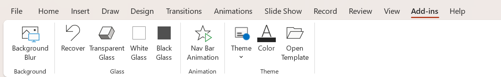
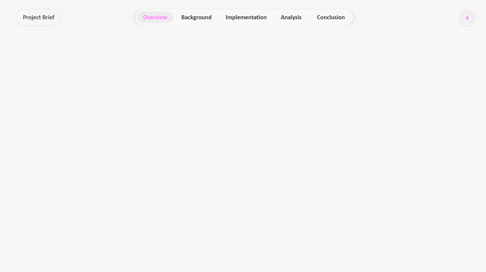

# PPT Assistant ✨

PPT Assistant is a VSTO add-in for Microsoft PowerPoint. It adds quick commands for background blur, glass-style shape effects, navigation bar animation, and reusable slide themes.

## Preview 🖼️

### PowerPoint Ribbon

### Glass Effects

### Theme Template

## Download 📦

Download the installer zip from GitHub Releases:

https://github.com/Canary1113/PowerPointAddIn/releases/latest

For the 2026-05-24 release, the installable asset is:

`PPTAssistantInstall-20260524.zip`

## Install 🚀

1. Download and unzip `PPTAssistantInstall-20260524.zip`.
2. Close all PowerPoint windows.
3. Run `Install-PPTAssistant.cmd`.
4. Open PowerPoint and look for the **PPT Assistant** ribbon.

The installer copies the VSTO files to the current user's local app data folder and registers the add-in under the current user's PowerPoint add-in registry key. It does not require administrator permission.

## Uninstall 🧹

Run `Uninstall-PPTAssistant.cmd` from the same extracted installer folder.

## Requirements ✅

- Microsoft PowerPoint for Windows.
- .NET Framework 4.7.2 or newer.
- Microsoft Visual Studio Tools for Office Runtime.

## Features 🛠️

- 🖼️ **Background Blur**: select one picture, then create a sharp full-slide foreground with a blurred slide background.
- 🧊 **Transparent Glass**: apply a transparent glass treatment to supported shapes.
- ⚪ **White Glass / Black Glass**: create light or dark layered glass effects.
- ↩️ **Recover**: remove glass effects generated by this add-in and restore the original shape appearance as much as possible.
- ⭐ **Nav Bar Animation**: add the preset navigation motion and scale animations to selected navigation shapes.
- 🎨 **Theme**: apply templates from `PowerPointAddIn/Assets/ThemeStyles.pptx`.
- 🌈 **Color**: customize the theme accent color.
- 📂 **Open Template**: open the theme template deck for editing.

## Usage 💡

1. Install the add-in.
2. Open PowerPoint.
3. Use the **PPT Assistant** ribbon group.
4. For object-based commands, select the object first:
   - **Background Blur** needs exactly one picture.
   - **Glass** commands need normal shapes. Pictures, groups, tables, charts, SmartArt, and media are skipped.
   - If you are editing text inside a text box, select the text box border before clicking a command.

## Theme Template 🎛️

The Theme menu is generated from sections in `PowerPointAddIn/Assets/ThemeStyles.pptx`.

- Add a section in the template deck to create a new Theme menu item.
- Put one or more slides under the section.
- If a section contains light and dark slides, both variants appear in the menu.
- Use **Open Template** on the ribbon to edit the template deck.

## Build 🧱

Open `PowerPointAddIn.slnx` in Visual Studio with the Office/VSTO workload installed.

The temporary signing certificate is intentionally not tracked. For local signed ClickOnce builds, create or import a local certificate named `PowerPointAddIn_TemporaryKey.pfx` in the project folder. If the file is missing, manifest signing is disabled by default so the public repository does not require a private key.

## Release 🔐

Do not publish private signing keys. Before creating a GitHub Release:

- Build the Release configuration.
- Create an installer zip from `PowerPointAddIn/bin/Release` plus the install/uninstall scripts.
- Confirm that no `.pfx` file is tracked by Git.
- Confirm that the release archive does not contain `PowerPointAddIn_TemporaryKey.pfx`.
- Attach the installable zip as the GitHub Release asset.
